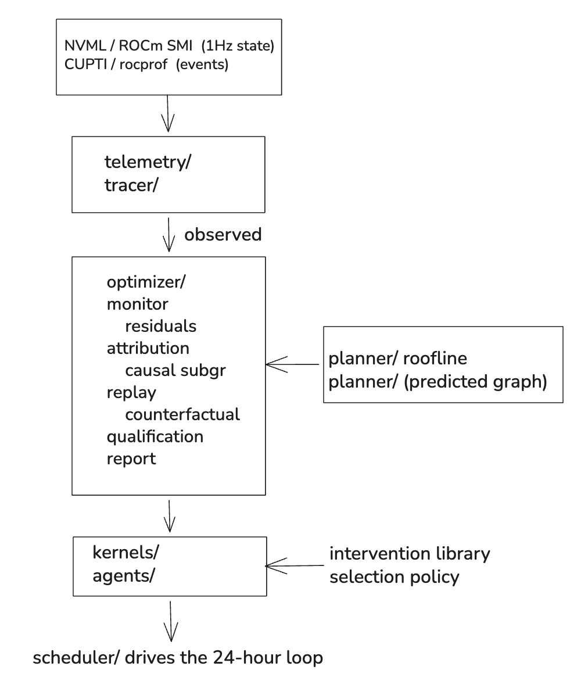

# runtime

Behavioral compiler + intervention runtime for vLLM decode workloads.

```bash
pip install -e .
gitm run --workload vllm-decode --budget 24h --target 15%
```

Embedded:

```python
from gitm import optimize
optimize(engine, budget="24h", target=0.15)
```

## Data layout

Two roots — set both before running anything:

```bash
export GITM_S3_ROOT="s3://gitm-data/prod"    # canonical store (datasets + archives)
export GITM_SCRATCH="/mnt/nvme/gitm"         # local ephemeral run dir (defaults to ~/.cache/gitm)
```

Canonical layout under `$GITM_S3_ROOT` (S3):

```
datasets/{hft,biotech,edge}/    # benchmark inputs (immutable, sha256-pinned)
runs/                            # durable baseline + pilot outputs
traces/                          # captured event-telemetry traces
telemetry/                       # state-telemetry samples (1Hz GPU state)
```

Local layout under `$GITM_SCRATCH` (ephemeral, synced to S3 after a run):

```
staging/    # datasets staged in from S3 for the active run, then evicted
runs/       # this run's outputs (small) before archival
traces/     # this run's trace before archival
telemetry/  # this run's samples before archival
```

## Architecture

See [docs/ARCHITECTURE.md](docs/ARCHITECTURE.md). The runtime is structured as
seven subpackages mirroring the data flow:

```
gitm/
  telemetry/   # state telemetry: NVML / ROCm SMI, 1Hz GPU state samples
  tracer/      # event telemetry: CUPTI / rocprof per-kernel records
  planner/     # behavioral compiler: predicted execution graph (roofline)
  optimizer/   # deviation monitor, attribution, replay, qualification, report
  kernels/     # curated intervention library (the levers)
  scheduler/   # 24-hour loop phase orchestration
  agents/      # autonomous decision policy (intervention selection)
```

## Invariants

The deviation monitor checks observed-vs-predicted against three invariants:

1. **Kernel-time invariant** — per-kernel duration must lie within roofline.
2. **Memory-traffic invariant** — per-kernel bytes-moved must match predicted.
3. **Stream-concurrency invariant** — predicted-concurrent kernels must overlap.

See [docs/invariants.md](docs/invariants.md).

## The 24-hour loop

| Phase | Hours | Module |
|---|---|---|
| 1. Capture trace, fingerprint workload, predict graph | 0–2 | `tracer`, `telemetry`, `planner` |
| 2. Compute residuals + causal attribution | 2–6 | `optimizer.monitor`, `optimizer.attribution` |
| 3. Query library, rank via counterfactual replay | 6–12 | `kernels`, `optimizer.replay` |
| 4. Apply top-N interventions with rollback gates | 12–20 | `agents`, `optimizer` |
| 5. Stabilize, write provenance report | 20–24 | `optimizer.report` |

## Architecture

GITM separates the **empirical** half (what happened) from the **predicted**
half (what should have happened). Everything downstream operates on residuals
— the difference between the two.

### Two telemetry planes

GITM never conflates these.

#### State telemetry (`gitm.telemetry`)

Point-in-time samples of GPU state at ~1 Hz:

- Utilization, memory used, power, clocks, temperature
- Throttle reasons (canonical bitmask across vendors)
- NVLink throughput, ECC counters

Source: **NVML** on NVIDIA, **ROCm SMI** on AMD.
Cost: ~microseconds per sample.
Shape: summary, not trace.

#### Event telemetry (`gitm.tracer`)

Per-kernel activity records with start/end timestamps, stream IDs, memory
transfer events.

Source: **CUPTI** on NVIDIA, **rocprof** on AMD.
Cost: per-kernel callbacks.
Shape: structurally a trace — required for the kernel-time invariant.

### Components



### Module responsibilities

| Module | Responsibility |
|---|---|
| `gitm.telemetry` | Vendor-backend autodiscovery, NVML/ROCm SMI samples, pluggable sinks |
| `gitm.tracer` | Event-telemetry capture (CUPTI/rocprof), trace schema, context manager |
| `gitm.planner` | Behavioral Compiler — roofline-based predicted execution graph |
| `gitm.optimizer.monitor` | Deviation monitor — residuals against 3 invariants |
| `gitm.optimizer.attribution` | Granger + doubly-robust on residual subgraph |
| `gitm.optimizer.replay` | Counterfactual replay for predicted intervention delta |
| `gitm.optimizer.qualification` | Workload fingerprint gate (commit / diagnose) |
| `gitm.optimizer.report` | Provenance chain renderer (claim → evidence → intervention → delta) |
| `gitm.kernels` | Curated intervention library — 15–20 levers with applicability + safety |
| `gitm.agents` | Autonomous policy — selects interventions, drives rollback |
| `gitm.scheduler` | 24-hour loop phase orchestration |

### Interfaces are contracts

The five primary interfaces below are the load-bearing contracts. W2 swarm
extends behind these without rewriting upstream code.

```python
# tracer
with gitm.tracer.capture(out_path: Path) -> ContextManager[Trace]: ...

# planner
graph = gitm.planner.predict_graph(model: ModelSpec, hw: HardwareSpec, batch: BatchConfig) -> Graph

# monitor
residuals = gitm.optimizer.monitor.residuals(trace: Trace, graph: Graph) -> Residuals
violations = gitm.optimizer.monitor.check_invariants(residuals, invariants) -> list[Violation]

# attribution
hypotheses = gitm.optimizer.attribution.attribute(residuals: Residuals, graph: Graph) -> RankedHypotheses

# report
report_md = gitm.optimizer.report.write(claims: list[Claim], provenance: Provenance) -> str
```

## Onboarding

This document is load-bearing for Day 6 — the six benchmark interns rotate
onto the skeleton using these steps. Every command here is expected to work
on a clean checkout.

### 1. Environment

```bash
git clone git@github.com:gitm-labs/runtime.git
cd runtime
python -m venv .venv
source .venv/bin/activate
pip install -e ".[dev]"
```

NVIDIA box additionally:

```bash
pip install -e ".[nvidia]"
```

Point at the canonical S3 store and a local scratch dir (see
[Data layout](#data-layout) — datasets live in S3, never on local disk):

```bash
export GITM_S3_ROOT="s3://gitm-data/prod"    # canonical store
export GITM_SCRATCH="/mnt/nvme/gitm"         # local scratch (defaults to ~/.cache/gitm)
```

`gitm doctor` reports both, plus discovered GPUs. Scratch subdirs are created
on first run.

### 2. Smoke test

```bash
gitm --help
gitm run --help
pytest -q
```

All three should pass on a clean checkout.

### 3. The 24-hour loop

The CLI entry point composes five subpackages in order. Read the source in
this order — it mirrors the data flow:

1. [`gitm/telemetry`](../gitm/telemetry/) — state telemetry (1 Hz GPU samples)
2. [`gitm/tracer`](../gitm/tracer/) — event telemetry (per-kernel records)
3. [`gitm/planner`](../gitm/planner/) — Behavioral Compiler (predicted graph)
4. [`gitm/optimizer`](../gitm/optimizer/) — monitor, attribution, replay, report
5. [`gitm/kernels`](../gitm/kernels/) — intervention library
6. [`gitm/agents`](../gitm/agents/) — selection policy
7. [`gitm/scheduler`](../gitm/scheduler/) — phase orchestration

Building a runtime system
gitm-labs/runtime, runtime/scheduler/, runtime/tracer/, runtime/optimizer/, runtime/kernels/, runtime/planner/, runtime/telemetry/, runtime/agents/


### 4. Where things live

| Concern | Path |
|---|---|
| Code | `gitm/` |
| Tests | `tests/` |
| Docs | `docs/` |
| Datasets, traces, runs | `$GITM_S3_ROOT/` (S3, canonical) · `$GITM_SCRATCH/` (local, ephemeral) |
| Intervention library | `gitm/kernels/library.yaml` |
| Report template | `gitm/optimizer/templates/report.md.j2` |
| Trace schema | `gitm/tracer/schema.py` (pydantic) |
| Telemetry schema | `gitm/telemetry/schema.py` (pydantic) |

### 5. Contributing a new component

Every new module hangs off one of the seven subpackages and exposes its public
surface through `__init__.py`. The five primary interfaces in
[ARCHITECTURE.md](ARCHITECTURE.md) are contracts — extend behind them, do not
change them, without Adit's sign-off.
